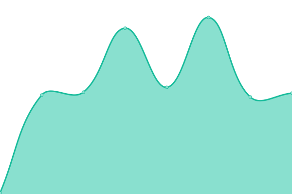
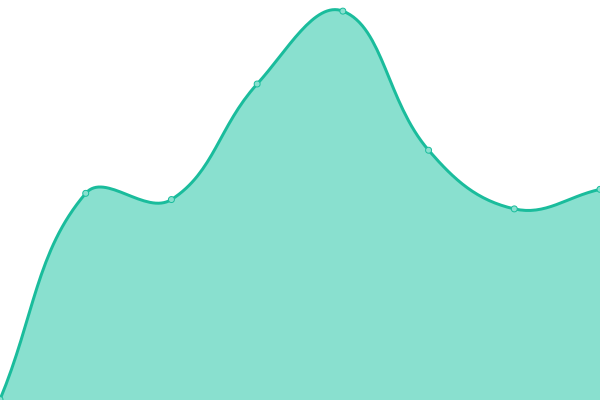
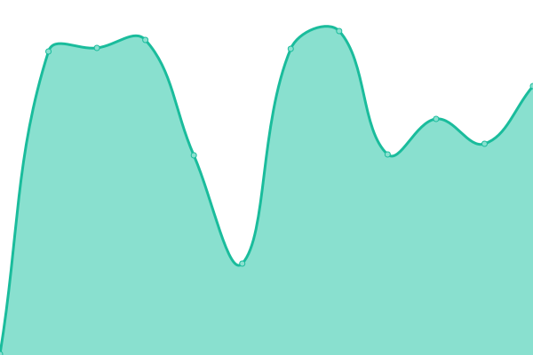

# [📈 Live Status](https://PatrykNamyslak.github.io/status-check): <!--live status--> **🟩 All systems operational**

This repository contains the open-source uptime monitor and status page for [Patryk](https://patryknamyslak.pl), powered by [Upptime](https://github.com/upptime/upptime).

With [Upptime](https://upptime.js.org), you can get your own unlimited and free uptime monitor and status page, powered entirely by a GitHub repository. We use [Issues](https://github.com/PatrykNamyslak/status-check/issues) as incident reports, [Actions](https://github.com/PatrykNamyslak/status-check/actions) as uptime monitors, and [Pages](https://PatrykNamyslak.github.io/status-check) for the status page.

<!--start: status pages-->
<!-- This summary is generated by Upptime (https://github.com/upptime/upptime) -->
<!-- Do not edit this manually, your changes will be overwritten -->
<!-- prettier-ignore -->
| URL | Status | History | Response Time | Uptime |
| --- | ------ | ------- | ------------- | ------ |
|  [patryknamyslak.pl](https://patl.ink/pn) | 🟩 Up | [patryknamyslak-pl.yml](https://github.com/PatrykNamyslak/status-check/commits/HEAD/history/patryknamyslak-pl.yml) | 

 501ms
     
 | 

<a href="https://PatrykNamyslak.github.io/status-check/history/patryknamyslak-pl">100.00%</a>
    

|  [Frontend Foundry](https://patl.ink/?url=iITaBt) | 🟩 Up | [frontend-foundry.yml](https://github.com/PatrykNamyslak/status-check/commits/HEAD/history/frontend-foundry.yml) | 

 595ms
     
 | 

<a href="https://PatrykNamyslak.github.io/status-check/history/frontend-foundry">97.91%</a>
    

|  [Patl.ink](https://patl.ink/) | 🟩 Up | [patl-ink.yml](https://github.com/PatrykNamyslak/status-check/commits/HEAD/history/patl-ink.yml) | 

 115ms
     
 | 

<a href="https://PatrykNamyslak.github.io/status-check/history/patl-ink">100.00%</a>
    

|  [Banking App](https://patl.ink/?url=8fTcEv) | 🟩 Up | [banking-app.yml](https://github.com/PatrykNamyslak/status-check/commits/HEAD/history/banking-app.yml) | 

 962ms
     
 | 

<a href="https://PatrykNamyslak.github.io/status-check/history/banking-app">100.00%</a>
    

|  [Dynamic Counter](https://patl.ink/?url=Oxt9Sk) | 🟩 Up | [dynamic-counter.yml](https://github.com/PatrykNamyslak/status-check/commits/HEAD/history/dynamic-counter.yml) | 

 576ms
     
 | 

<a href="https://PatrykNamyslak.github.io/status-check/history/dynamic-counter">100.00%</a>
    

|  [CO-OP Tic Tac Toe](https://patl.ink/?url=xDdetI) | 🟩 Up | [co-op-tic-tac-toe.yml](https://github.com/PatrykNamyslak/status-check/commits/HEAD/history/co-op-tic-tac-toe.yml) | 

 240ms
     
 | 

<a href="https://PatrykNamyslak.github.io/status-check/history/co-op-tic-tac-toe">100.00%</a>
    

<!--end: status pages-->

[**Visit our status website →**](https://PatrykNamyslak.github.io/status-check)

## 📄 License

- Powered by: [Upptime](https://github.com/upptime/upptime)
- Code: [MIT](./LICENSE) © [Anand Chowdhary](https://anandchowdhary.com), supported by [Pabio](https://pabio.com)
- Data in the `./history` directory: [Open Database License](https://opendatacommons.org/licenses/odbl/1-0/)
