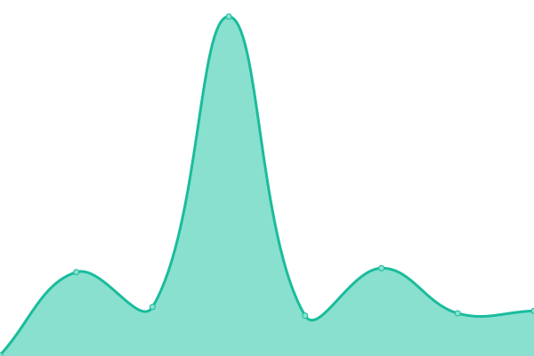

# [📈 Live Status](https://PatrykNamyslak.github.io/status-check): <!--live status--> **🟧 Partial outage**

This repository contains the open-source uptime monitor and status page for [Patryk](https://patryknamyslak.pl), powered by [Upptime](https://github.com/upptime/upptime).

With [Upptime](https://upptime.js.org), you can get your own unlimited and free uptime monitor and status page, powered entirely by a GitHub repository. We use [Issues](https://github.com/PatrykNamyslak/status-check/issues) as incident reports, [Actions](https://github.com/PatrykNamyslak/status-check/actions) as uptime monitors, and [Pages](https://PatrykNamyslak.github.io/status-check) for the status page.

<!--start: status pages-->
<!-- This summary is generated by Upptime (https://github.com/upptime/upptime) -->
<!-- Do not edit this manually, your changes will be overwritten -->
<!-- prettier-ignore -->
| URL | Status | History | Response Time | Uptime |
| --- | ------ | ------- | ------------- | ------ |
|  [patryknamyslak.pl](https://PatrykNamyslak.pl) | 🟩 Up | [patryknamyslak-pl.yml](https://github.com/PatrykNamyslak/status-check/commits/HEAD/history/patryknamyslak-pl.yml) | 

 763ms
     
 | 

<a href="https://PatrykNamyslak.github.io/status-check/history/patryknamyslak-pl">99.37%</a>
    

|  [aver.digital](Https://aver.digital) | 🟥 Down | [aver-digital.yml](https://github.com/PatrykNamyslak/status-check/commits/HEAD/history/aver-digital.yml) | 

 214ms
     
 | 

<a href="https://PatrykNamyslak.github.io/status-check/history/aver-digital">0.00%</a>
    

|  [Frontend Foundry](Https://frontend-foundry.patryknamyslak.pl) | 🟩 Up | [frontend-foundry.yml](https://github.com/PatrykNamyslak/status-check/commits/HEAD/history/frontend-foundry.yml) | 

 1318ms
     
 | 

<a href="https://PatrykNamyslak.github.io/status-check/history/frontend-foundry">99.76%</a>
    

|  [Cypherus Wallet app](https://cypherus.site) | 🟥 Down | [cypherus-wallet-app.yml](https://github.com/PatrykNamyslak/status-check/commits/HEAD/history/cypherus-wallet-app.yml) | 

 403ms
     
 | 

<a href="https://PatrykNamyslak.github.io/status-check/history/cypherus-wallet-app">13.03%</a>
    

|  [Url Shortener](https://patl.ink/) | 🟩 Up | [url-shortener.yml](https://github.com/PatrykNamyslak/status-check/commits/HEAD/history/url-shortener.yml) | 

 744ms
     
 | 

<a href="https://PatrykNamyslak.github.io/status-check/history/url-shortener">99.38%</a>
    

<!--end: status pages-->

[**Visit our status website →**](https://PatrykNamyslak.github.io/status-check)

## 📄 License

- Powered by: [Upptime](https://github.com/upptime/upptime)
- Code: [MIT](./LICENSE) © [Anand Chowdhary](https://anandchowdhary.com), supported by [Pabio](https://pabio.com)
- Data in the `./history` directory: [Open Database License](https://opendatacommons.org/licenses/odbl/1-0/)
